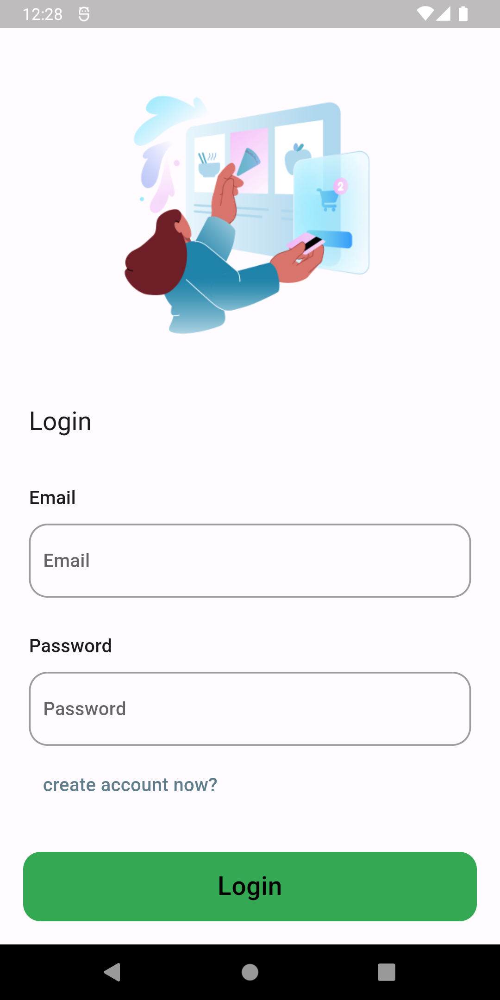
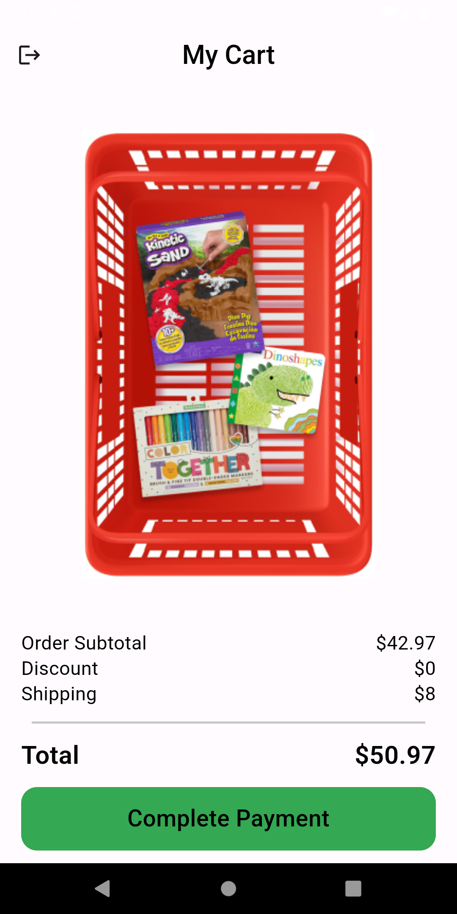
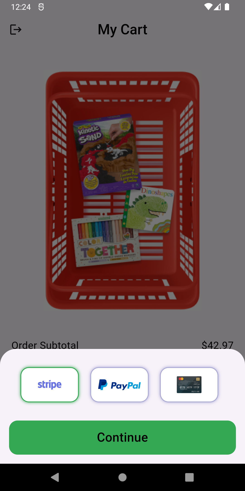
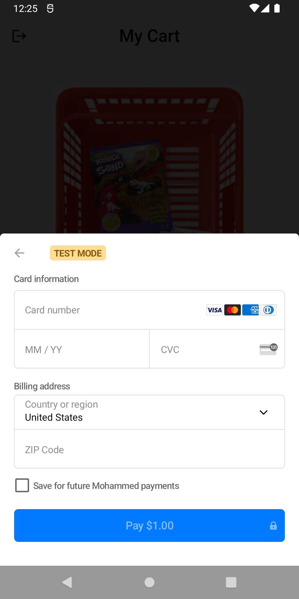
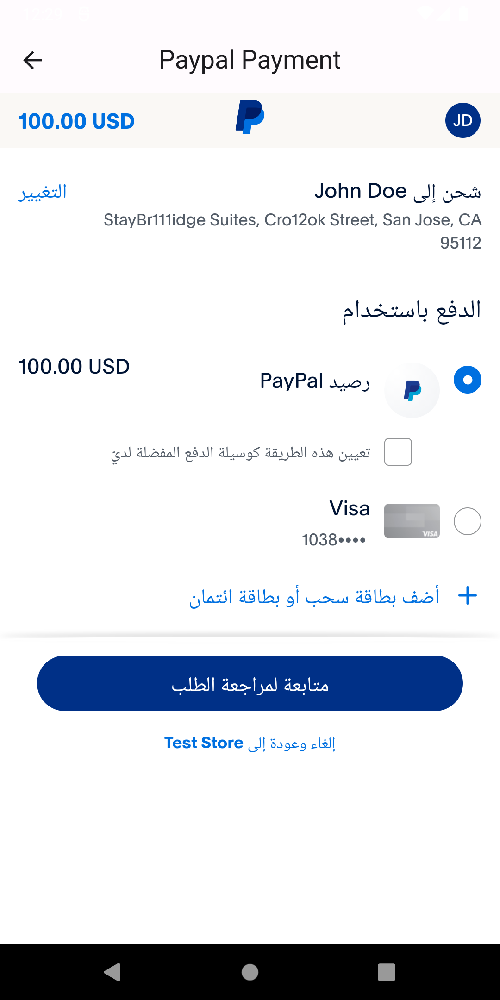
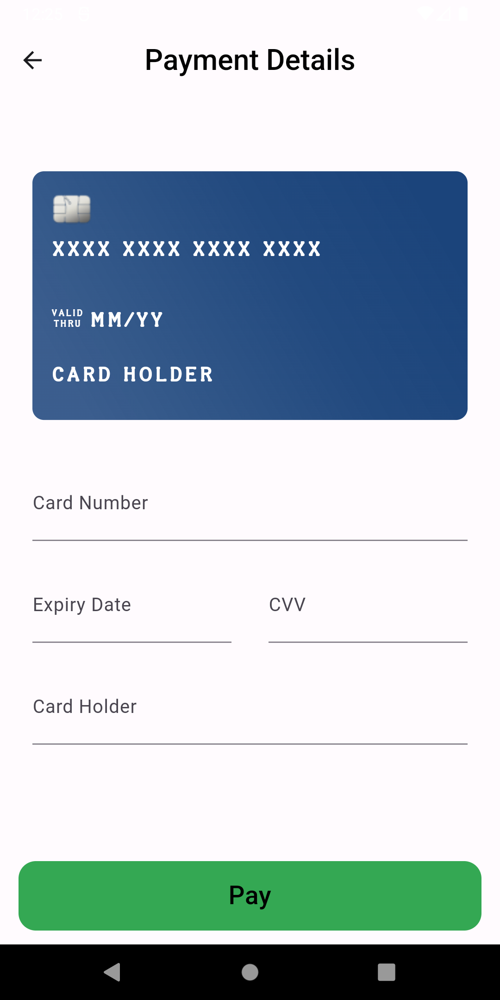
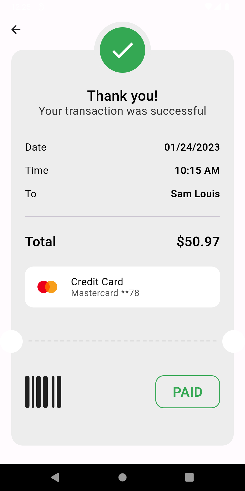

<div align="center">


  

<br>
<h1> Demo Checkout Payment 
    <br>
    <p style="font-size: 21px;font-weight: 100;">Payment gateway with Stripe, paypal, card form</p>
    <br>
    
    
    
</h1> 
<br>
<div align="left">

## Development Setup
Clone the repository and run the following commands:

```
git clone https://github.com/colonal/checkout_payment.git
cd checkout_payment
```

Create .env file in root project ./.env
add values
```
SECRET_KEY=sk_test_...
PUBLISHABLE_KEY=pk_test_...
CLIENT_Id=AdCe1dq...
CLIENT_SECRET=EJ537kLmUsZkIe6dk_...
```
run command
```
flutter pub get
flutter run 
```

<br>

## Screenshot
<br>
 
 
 
 
<br>
<br>

 
> This is a tutorial presented in a course by <a href ='https://github.com/tharwatsamy'> Tharwat Samy </a> 


## Sources
  * Flutter Payment Integration: Stripe, PayPal & More! course: https://www.udemy.com/course/flutter-payment-integration-stripe-paypal-more-arabic/
  * Authentication api: http://apingweb.com
  * stripe docs: https://stripe.com/docs/api
  * paypal docs: https://developer.paypal.com/home